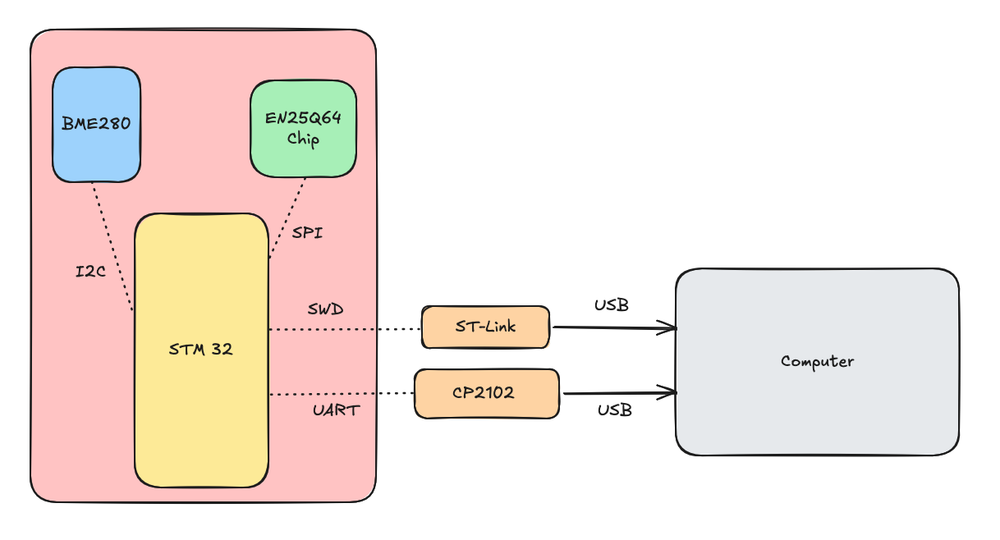
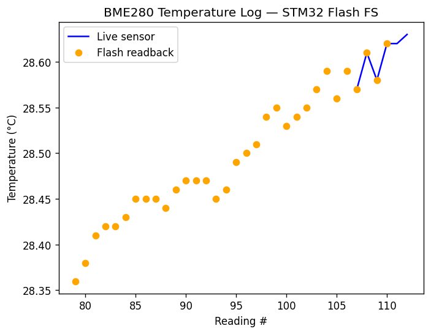
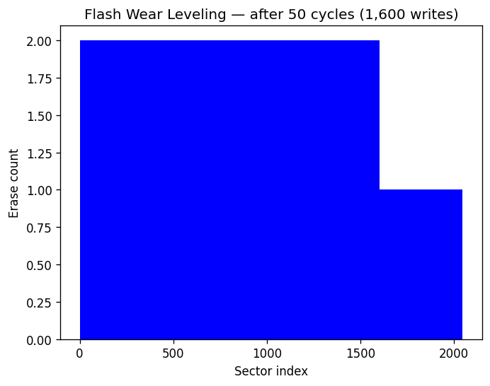
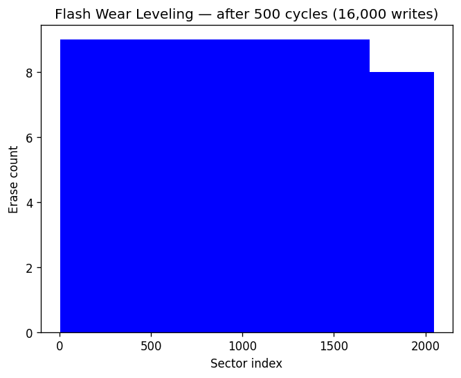

# STM32 Bare-Metal Flash File System
A baremental flash file system for STM32 Blue Pill from scratch in C++, uilding up from low-level hardware drivers to a working filesystem layer with zero external dependencies.

## Project Overview

A from-scratch flash file system for the STM32F103C8T6 (Cortex-M3). Every layer — reset/vector table, `.data`/`.bss` init, UART/SPI/I2C drivers, the EN25Q64 NOR command layer, and the file system itself — is hand-written against the reference manual with no vendor abstractions and no C library. It persists BME280 sensor readings to an 8 MB SPI NOR chip with wear leveling, per-page CRC integrity, and power-cycle persistence.

## Hardware
| Component | Quantity |
|-----------|----------|
| STM32 | 1 |
| EN25Q64 SPI NOR Flash (8MB) | 1 |
| Bosch BME280| 1 |
| CP2102 USB-UART Adapter | 1 |
| ST-Link V2 Programmer | 1 |

## Wiring

**EN25Q64 SPI NOR Flash → STM32 (SPI1):**
* CS → PA4 (NSS, chip select)
* CLK → PA5 (SCK)
* DO → PA6 (MISO)
* DI → PA7 (MOSI)
* VCC → 3.3V
* GND → GND

**BME280 → STM32 (I2C1, 100kHz):**
* SCL → PB6 (I2C clock)
* SDA → PB7 (I2C data)
* VCC → 3.3V
* GND → GND

**CP2102 USB-UART → STM32 (USART1, 115200 baud):**
* RXD → PA9 (STM32 TX)
* TXD → PA10 (STM32 RX)
* GND → GND

## Hardware Architecture

**Flash layout** (2048 × 4 KB sectors):

| Region | Address | Contents |
|--------|---------|----------|
| Superblock + directory | `0x000000` (sector 0) | magic `0xDEADBEEF`, format version, geometry, `DirectoryEntry` table |
| Allocation table | `0x001000` (sectors 1–3) | one `AllocationEntry` per data sector |
| Data | `0x004000` (sectors 4+) | file pages |

**Key data structures:**
- **`Superblock`** — magic + format version + geometry. `fs_init` validates magic/version and reformats if missing or stale (version is bumped on any on-flash layout change).
- **`PageHeader`** (12 B, prepended to each 256 B page) — `state`, `file_id`, `file_offset`, `data_length`, and a **CRC16** over the 244 B payload, verified on every read.
- **`DirectoryEntry`** — `filename[16]`, `file_id`, `file_size`, `firstpage_addr`, `status`. `firstpage_addr` is `0xFFFFFFFF` until the first write, so reads of an unwritten file fail cleanly.
- **`AllocationEntry`** (5 B, `__attribute__((packed))`) — per-sector `state` + `erase_count`. Packed so the table fits the 3 reserved sectors instead of spilling into data sector 0.

**Wear leveling:** `fs_find_free_sector` selects the free data sector with the **lowest `erase_count`**, incremented on each write. *(Current limitation: overwritten sectors are not reclaimed — the log fills flash monotonically over ~2044 writes.)*

## Driver Stack

Bottom-up, each layer a thin register-level interface:

- **UART** (`uart.cpp`) — USART1 TX at 115200 (BRR=69 @ 8 MHz). Byte/string output for logging.
- **SPI** (`spi.cpp`) — SPI1 master, mode 0, software NSS on PA4, full-duplex byte transfer with bounded timeouts; drains stale RXNE around every byte.
- **Flash** (`flash.cpp`) — EN25Q64 commands: WREN (`0x06`), RDSR (`0x05`), sector-erase (`0x20`), page-program (`0x02`), read (`0x03`); 24-bit addressing, WIP-polled with a bounded timeout.
- **File system** (`fs.cpp`) — superblock/directory/allocation management, CRC-checked pages, wear-leveled allocation. API: `fs_init`, `fs_create`, `fs_write`, `fs_read`.
- **I2C** (`BME280.cpp`) — I2C1 master @ 100 kHz, bounded-timeout transactions, BUSY-before-START guard, RM0008 single-byte receive sequence.
- **BME280** (`BME280.cpp`) — sensor config + Bosch fixed-point temperature compensation; calibration read once at init.

## Protocol

`main.cpp` runs a persistent sensor-logging loop:

1. Initializes UART/SPI/FS/BME280 and creates 32 per-slot files (`file_id` 0–31).
2. **Each iteration** (~24 s apart — an uncalibrated busy-wait delay, not a timer): reads the BME280 temperature, writes a `SensorReading {seq, temp in units of 0.01°C}` to slot `seq % 32`, and streams a live `seq + temp` record (big-endian `uint32` + `int32`) over UART.
3. **Every 5th iteration:** wraps a readback of all 32 slots in `READBACK:` / `END` markers, streaming each stored `seq + temp` record (CRC-verified) — proving round-trip integrity.
4. **Power-cycle persistence:** on boot `fs_init` finds the existing superblock and reuses the directory, so prior readings are immediately readable.

`tools/listen.py` decodes the mixed text/binary UART stream on the host.

## Visualization

- **`tools/listen.py`** — decodes the board's mixed text/binary UART stream on the host and prints each line and `seq + temp` record to the console.
- **`tools/visualize.py`** — plots that same stream live with matplotlib, drawing live sensor readings as a line and flash-readback values as dots.
- **`tools/flash_analyzer.py`** — dumps the raw on-flash image over UART and decodes it, printing the superblock/directory/CRC report and rendering the wear-leveling chart.
 
<p align="center">
  
</p>  
 `Generated by streaming the board's live UART output through `visualize.py`, which plots each loop's BME280 reading (blue line) against the values read back from flash (orange dots).`

 
<p align="center">
  
  
</p>
`Generated by triggering a full flash dump with `flash_analyzer.py`, which charts the erase count of every sector to show the allocator spreading wear evenly.`


```bash
python3 tools/visualize.py /dev/cu.usbserial-0001 115200       # live temperature plot
python3 tools/flash_analyzer.py /dev/cu.usbserial-0001 115200  # wear chart (then press RESET)
```

## Build and Flash

Toolchain: `arm-none-eabi-g++`, OpenOCD, ST-Link V2.

```
make             # build flashfs.elf
make flash       # program via OpenOCD / ST-Link
make erase_flash # mass-erase MCU flash, then program
make test        # host unit tests (RAM-backed flash stub — no hardware needed)
```

## Key Technical Challenges

- **SPI full-duplex stale RXNE** — draining the shifted-in byte after every transmit to keep reads in sync.
- **NOR write model** — erase-before-write, since NOR clears bits only 1→0.
- **I2C single-byte receive (EV6_1)** — the exact ACK/STOP ordering a 1-byte read requires per RM0008.
- **Brownout during sector erase** — the erase current spike sags the 3.3 V rail; surfaced with bounded timeouts.
- **Root-causing implausible readings** — traced wild temperatures to an uninitialized readback buffer, not a failed I2C read.
